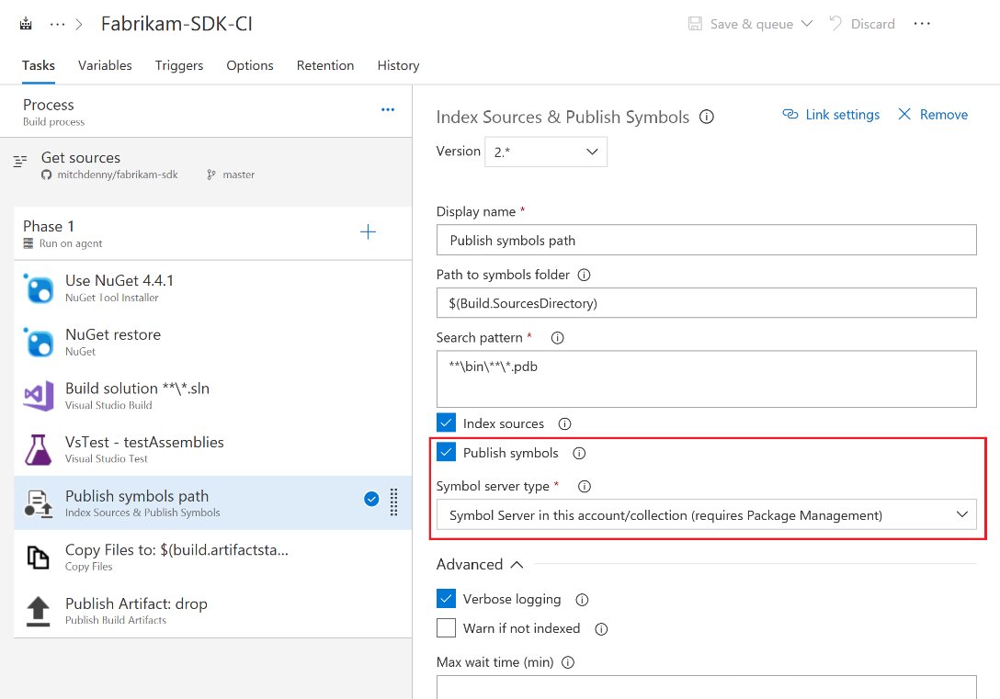
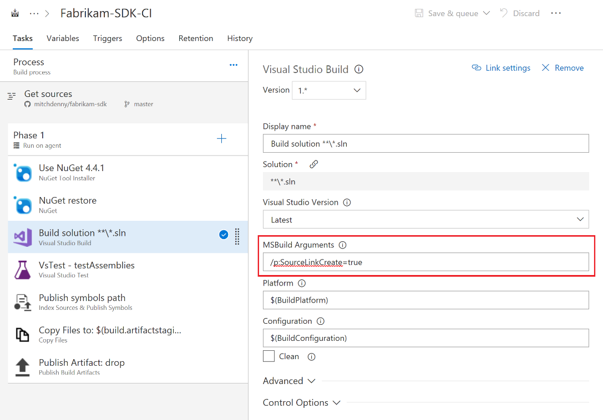
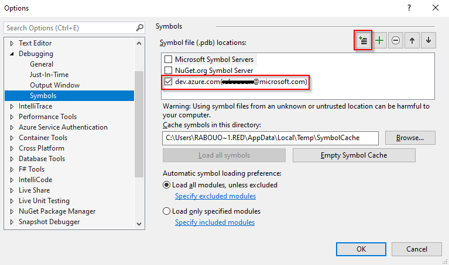
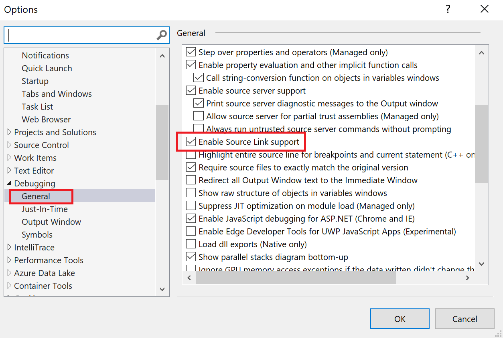
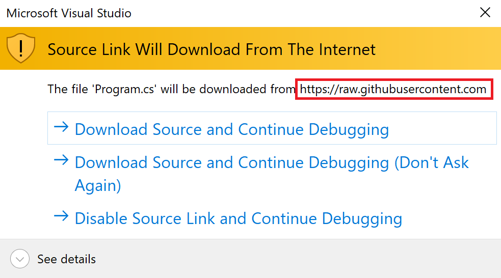
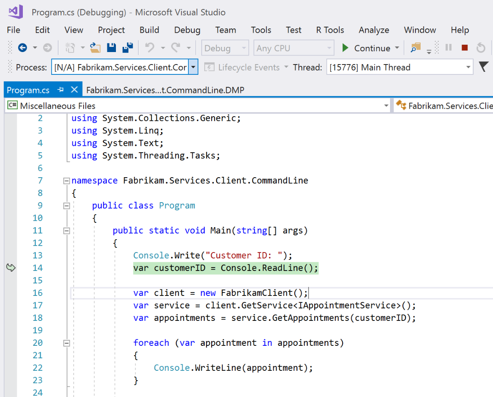

---
title: Publish symbols to Azure Artifacts symbol server
description: Using Index Sources & Publish Symbols task to publish  symbols to Azure Artifacts symbols server
ms.technology: devops-artifacts
ms.assetid: 3cb56371-3ef2-4bd9-871b-ec6cfa93bedf
ms.date: 10/29/2020
ms.topic: conceptual
monikerRange: '>= tfs-2017'
---

# Use Index Sources & Publish Symbols task to publish your symbols

Symbols are PDB files that are generated after a successful build run. these files are used by developers to debug their application. Azure Artifacts now offers a dedicated symbols server to publish your symbols. 

The _Publish symbols_ feature is part of the **Index Sources & Publish Symbols** task. This feature is also available for GitHub repositories.

To publish your symbols check the **Publish symbols** checkbox and select the **Symbol Server in this account/collection** option from the dropdown.

> [!div class="mx-imgBorder"] 
> 

## Using Source Link in .NET projects

Source link is a set of tools that allow developers to debug their source code by mapping from the .NET assemblies back to the source code.

For projects hosted on GitHub, add the `Microsoft.SourceLink.GitHub` package reference to your project file.

```xml
<ItemGroup>
  <PackageReference Include="Microsoft.SourceLink.GitHub" Version="1.0.0" PrivateAssets="All"/>
</ItemGroup>
```

For projects hosted on Azure Repos, add the `Microsoft.SourceLink.AzureRepos.Git` package reference to your project file.

```xml
<ItemGroup>
  <PackageReference Include="Microsoft.SourceLink.AzureRepos.Git" Version="1.0.0" PrivateAssets="All"/>
</ItemGroup>
```

## Modifying the Build Pipeline

The next step is to modify the build pipeline to invoke Source Link during the build process. To do so, add `/p:SourceLinkCreate=true` to the **MSBuild arguments** field within the **Visual Studio Build** task.

> [!div class="mx-imgBorder"] 
> 

Select **Save & queue** to save and run your build pipeline when an agent is available.

## Set up Visual Studio

Once the build has been completed and the symbols published, it is time to make sure that everything is working properly. But first, we must ensure that Visual Studio is set up properly.

1. Select **Tools** then **Options**.

1. Under **Debugging**, select **Symbols**.

1. Select the `+` sign to add a new symbol file location then type your URL.

    > [!div class="mx-imgBorder"]
    > 

1. Select **General** under the same section. Scroll down and check **Enable Source Link support**.

    > [!div class="mx-imgBorder"]
    > 

## Verifying the Setup

Now that Visual Studio is configured, it is time to attach the debugger to the process you want to debug. Once the debugger is attached Visual Studio will establish connection to the symbols server and attempt to locate the symbols.

The first time Visual Studio attempts to download the source code it will prompt the user for input.

> [!div class="mx-imgBorder"]
> 

Visual Studio will then download the file(s) needed and launch the code editor at a break point.

> [!div class="mx-imgBorder"]
> 

> [!TIP]
> When attaching to a process, you may need to uncheck the **Enable Just My Code** option. See [Enable or disable Just My Code](/visualstudio/debugger/just-my-code) for details.

## Related articles

- [Publish Symbols for Debugging](/azure/devops/pipelines/symbols/)
- [Build: Index & Publish Symbols](../../pipelines/tasks/build/index-sources-publish-symbols.md)