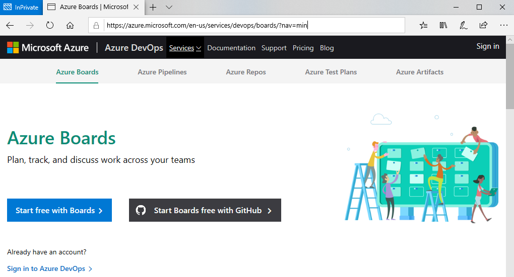
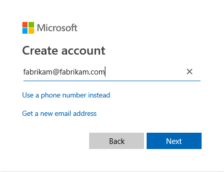
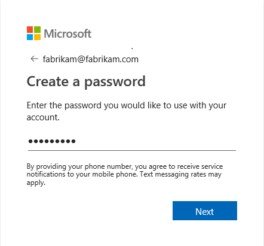
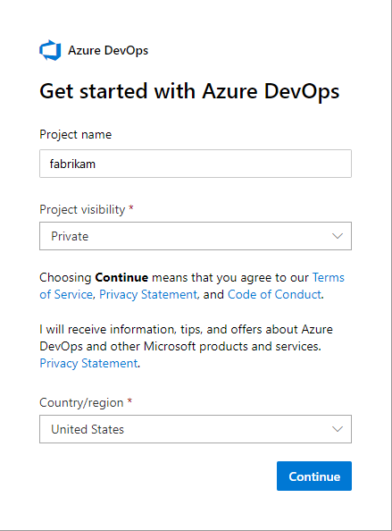
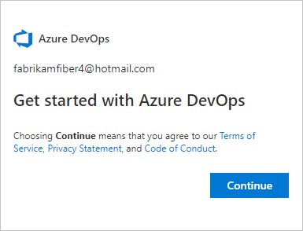

# Sign up for free and invite others to collaborate in Azure Boards

[!INCLUDE [temp](../includes/version-vsts-only.md)]

Sign up for an Azure DevOps organization and Azure Boards to begin planning and tracking work. This sequence walks you through the sign-up process for users located in the United States and that sign up through [azure.com/boards](https://azure.microsoft.com/services/devops/boards/?nav=min). In the end, you'll have a project that uses the [Basic process for work tracking](./what-is-azure-boards.md).

You can sign up for free with either a Microsoft or GitHub account. If you don't have a Microsoft account, this article will guide you in acquiring one. 

> [!div class="mx-imgBorder"]  
> 

## Create a Microsoft account and sign up

If you don't have a Microsoft account or GitHub account, follow these steps. 

1. Open [Azure Boards](https://azure.microsoft.com/services/devops/boards) and choose **Start free with Boards**.

2. Choose **Create one** and enter an email address or phone number. Or, you can create an Outlook account at this time. To learn more, see [create a Microsoft account](https://support.microsoft.com/help/4026324/microsoft-account-how-to-create). 

	> [!div class="mx-imgBorder"]  
	> 

	Here we enter the `fabrikam@fabrikam.com` email account. 

	> [!div class="mx-imgBorder"]  
	> 

3. Enter a password you want to use with Azure DevOps and choose **Next**.

	> [!div class="mx-imgBorder"]  
	> 

3. Check your email account and enter the code provided. Choose  **Next**.

	> [!div class="mx-imgBorder"]  
	> 

	An organization is created based on your sign-in account name. Sign in to your organization at any time by specifying (`https://dev.azure.com/{yourorganization}`).

4. A project is created based on your sign-in account name. You can make changes to the settings shown, or change them later. To get started with Azure DevOps, choose **Continue**.

   

	Your project name can't contain special characters (such as / : \ ~ & % ; @ ' " ? < > | # $ * } { , + = [ ]), can't begin with an underscore, can't begin or end with a period, and must be 64 characters or less. Visibility can be either public or private. With public visibility, anyone on the internet can view your project. With private visibility, only people who you give access to can view your project.

Your next step is to start using your Kanban board to [track issues and tasks](plan-track-work.md), or [invite other users](#invite-others) to collaborate with your project. 

## Sign up with a personal Microsoft account

If you have a Microsoft account, follow these steps to sign up for Azure Boards. 

1. Open [Azure Boards](https://azure.microsoft.com/services/devops/boards) and choose **Start free with Boards**.

2. Enter your email address, phone number, or Skype ID for your Microsoft account. If you're a Visual Studio subscriber and you get Azure DevOps as a benefit, use the Microsoft account associated with your subscription. Select **Next**.

	> [!div class="mx-imgBorder"]  
	> 

3. Enter your password and select **Sign in**.

   

4. To get started with Azure Boards, select **Continue**.

	> [!div class="mx-imgBorder"]  
	> 

	An organization is created based on the account you used to sign in. Use the following URL to sign in to your organization at any time:

	`https://dev.azure.com/{yourorganization}`

Your next step is to [create a project](#create-project). 

## Sign up with a GitHub account

If you have a GitHub account, follow these steps to sign up for Azure Boards. 

> [!IMPORTANT]
> If your GitHub email address is associated with an Azure AD-backed organization in Azure DevOps, you can't sign in with your GitHub account, rather you must sign in with your Azure AD account.

1. Choose **Start Boards free with GitHub**. If you're already part of an Azure DevOps organization, choose **Sign in to Azure DevOps**.

	> [!div class="mx-imgBorder"]  
	> 

2. Enter your GitHub account credentials, and then select **Sign in**.

   

4. Select **Authorize Microsoft corporation**.

   

5. Choose **Continue**.

   

	An organization is created based on the account you used to sign in. Use the following URL to sign in to your organization at any time:

	`https://dev.azure.com/{yourorganization}`

For more information about GitHub authentication, see [FAQs](../../organizations/security/faq-github-authentication.md).

Your next step is to  [create a project](#create-project). 

<a id="create-project" />

## Create a project 

If you signed up for Azure DevOps with an existing MSA or GitHub identity, you're automatically prompted to create a project. You can create either a public or private project. To learn more about public projects, see [What is a public project?](../../organizations/public/about-public-projects.md). 

1. Enter a name for your project, select the visibility, and optionally provide a description. Then choose **Create project**. 

	> [!div class="mx-imgBorder"]  
	> 

	The name can't contain special characters (such as / : \ ~ & % ; @ ' " ? < > | # $ * } { , + = [ ]), can't begin with an underscore, can't begin or end with a period, and must be 64 characters or less. Visibility can be either public or private. With public visibility, anyone on the internet can view your project. With private visibility, only people who you give access to can view your project.
	
2. When your project has been created, the Kanban board automatically appears.

	> [!div class="mx-imgBorder"]
	> 

	You're now set to start [tracking issues, tasks, and features](plan-track-work.md), or [invite other users](#invite-others) to collaborate with your project. 

<a id="invite-others" />

## Invite team members

You can add and invite others to work on your project by adding their email address to your organization and project.

1. From your project web portal, choose the :::image type="icon" source="../../media/icons/project-icon.png" border="false"::: Azure DevOps icon, and then select :::image type="icon" source="../../media/icons/gear-icon.png" border="false"::: **Organization settings**. 

   

2. Select **Users** > **Add new users**.

   :::image type="content" source="../../media/add-new-users.png" alt-text="Select Add users"::: 

3. Complete the form by entering or selecting the following information:  
	- **Users:** Enter the email addresses (Microsoft accounts) or GitHub IDs for the users. You can add several email addresses by separating them with a semicolon (;). An email address appears in red when it's accepted.  
	- **Access level:** Assign one of the following access levels: 
		- **Basic**: Assign to users who must have access to all Azure Boards features. You can grant up to five users <strong>Basic</strong> access for free.  
        - **Stakeholder**: Assign to users who will have limited access to features to view, add, and modify work items. You can assign an unlimited number of users **Stakeholder** access for free.   
	- **Add to project**: Select the project you named in the preceding procedure.  
    - **Azure DevOps Groups**: Select one of the following security groups which will determine the permissions the users have to perform select tasks (To learn more, see [Default permissions and access for Azure Boards](permissions-access-boards.md).):  
        - **Project Readers**: Assign to users who only require read-only access.   
        - **Project Contributors**: Assign to users who will contribute fully to the project.  
        - **Project Administrators**: Assign to users who will configure project resources.  
		
	> [!NOTE]  
	> Add email addresses for [personal Microsoft accounts](https://account.microsoft.com/account) and IDs for GitHub accounts unless you plan to use [Azure Active Directory (Azure AD)](/azure/active-directory/fundamentals/active-directory-whatis) to authenticate users and control organization access. If a user doesn't have a Microsoft or GitHub account, ask the user to [sign up](https://signup.live.com/) for a Microsoft account or a GitHub account.  

4. When you're done, select **Add** to complete your invitation.

For more information, see [Add organization users for Azure DevOps Services](../../organizations/accounts/add-organization-users.md).

## Change organization or project settings

You can rename and delete your organization, or change the organization location. To learn more, see the following articles:

- [Manage organizations](../../organizations/accounts/organization-management.md)
- [Rename an organization](../../organizations/accounts/rename-organization.md)
- [Change the location of your organization](../../organizations/accounts/change-organization-location.md)

You can rename your project or change it's visibility. To learn more about managing projects, see the following articles:

- [Manage projects](../../organizations/projects/about-projects.md)
- [Rename a project](../../organizations/projects/rename-project.md)
- [Change the project visibility, public or private](../../organizations/public/make-project-public.md)

> [!NOTE]   
> Your first project was created using the Basic process which uses Epics, Issues, and Tasks to track work. If you want a project that uses the Agile, Scrum, or CMMI process, then you can [add another project](../../organizations/projects/create-project.md) and specify the process through advanced setting options. See [Choose a process for a comparison of processes](../work-items/guidance/choose-process.md). 
 
## Try this next  
 
> [!div class="nextstepaction"]
> [Track issues and tasks](plan-track-work.md)

## Related articles  

- [Manage projects](../../organizations/projects/about-projects.md)
- [Manage organizations](../../organizations/accounts/organization-management.md)
- [About access levels](../../organizations/security/access-levels.md)
- [Define organizations and projects](../../user-guide/plan-your-azure-devops-org-structure.md)