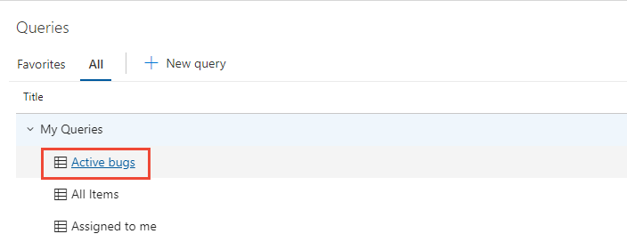
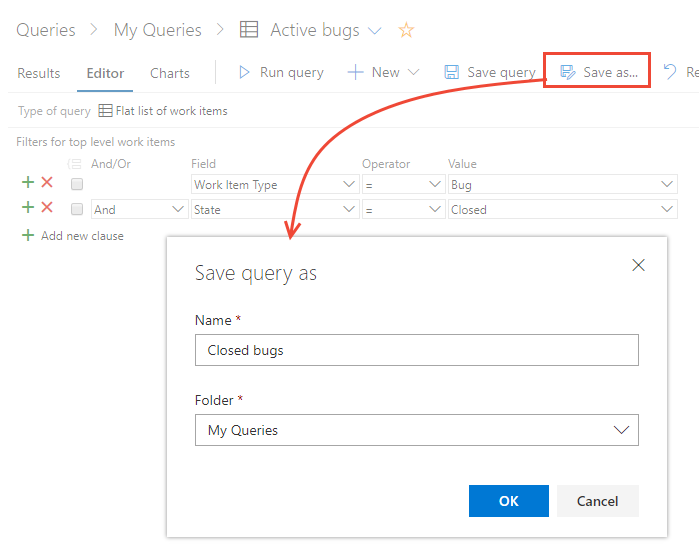

# Manage and organize queries   

[!INCLUDE [temp](../includes/version-all.md)]

Organize your personal or shared queries by adding a query folder. You can then add queries to or move existing queries into those folders. You can create queries and query folders from the web portal or from a supported client, such as Visual Studio Team Explorer and [Team Explorer Everywhere](../../user-guide/work-team-explorer.md#team-explorer-plug-in-for-eclipse), a plug-in for [Eclipse](https://www.eclipse.org/).

> [!NOTE]  
> To create and manage queries in Visual Studio 2019, you need to [Set the Work Items experience](../work-items/set-work-item-experience-vs.md) to the legacy option.

 
[!INCLUDE [temp](../includes/prerequisites-queries.md)]

## Open Queries 

[!INCLUDE [temp](../includes/open-queries.md)] 

<a id="flat-list-query"/>
<a id="save" />

## Open, edit, and save a query  

The easiest way to define a query is to start with an existing shared query. 
The following example shows how to find all closed bugs by modifying the 
*Active Bugs* shared query provided with the Agile process template. Examples are based on the user interface provided through the web portal. 

::: moniker range=">= azure-devops-2019"  

1. Open a shared query. For example, from the web portal, open the *Active Bugs* or similar flat list query.   

   > [!div class="mx-imgBorder"]  
   >   

   > [!TIP]  
   > If you're working in Visual Studio Team Explorer, open the **Work** page to access your queries and shared queries. If Team Explorer isn't visible, choose **View>Team Explorer** from the top level menu.   

1. Edit the query to find closed bugs and then run the query. 
   Use  to insert a clause above the current clause. Use  to delete a clause.  Queries are automatically scoped to the current project. To find work items defined in several projects, see [Query across projects](using-queries.md#across-projects). 

   > [!div class="mx-imgBorder"]
   >  

2. Save the query to your **My Queries** folder.  

   > [!div class="mx-imgBorder"]  
   >   

   To save a query to the **Shared Queries** folder, you need to be a member of the [Project Administrators group](../../organizations/security/add-users-team-project.md), or have your **Contribute** permissions on the folder set to **Allow**. To learn more, see [Set query permissions](set-query-permissions.md).  

::: moniker-end

::: moniker range="<= tfs-2018"  

1. Open a shared query. For example, from the web portal, open the *Active Bugs* or similar flat list query.   

     

   > [!TIP]  
   > If you're working in Visual Studio Team Explorer, open the **Work** page to access your queries and shared queries. If Team Explorer isn't visible, choose **View>Team Explorer** from the top level menu.   

1. Edit the query to find closed bugs and then run the query. 
   Use  to insert a clause above the current clause. Use  to delete a clause.  Queries are automatically scoped to the current project. To find work items defined in several projects, see [Query across projects](using-queries.md#across-projects).      
	
     

2. Save the query to your **My Queries** folder.  
	
     

   To save a query to the **Shared Queries** folder, you need to be a member of the [Project Administrators group](../../organizations/security/add-users-team-project.md), or have your **Contribute** permissions on the folder set to **Allow**. To learn more, see [Set query permissions](set-query-permissions.md).  

::: moniker-end  

<a id="view-rename-delete" />

## Rename or delete a query

::: moniker range=">= azure-devops-2019"

From either the **Favorites** or **All** page, choose the  :::image type="icon" source="../media/icons/actions-icon.png" border="false"::: actions icon of a query to run, edit, rename, or delete the query. 

  

For shared queries, you can also choose to perform one of these tasks: 
- **Add to team queries**: Select the team to add the query as a team favorite
- **Security...**: to set permissions for the query. To learn more, see [Set query permissions](set-query-permissions.md).   
- **Add to dashboard**: Adds a Query tile widget to the team dashboard you select. To learn more, see [Add widgets to a dashboard](../../report/dashboards/add-widget-to-dashboard.md). 

::: moniker-end

::: moniker range="<= tfs-2018"  

Choose the :::image type="icon" source="../media/icons/context_menu.png" border="false"::: context menu icon of a query to edit, rename, or delete the query.

::: moniker-end

## Add a query folder, move items into a folder 

> [!TIP]   
> You need **Delete** permissions to rename or move a shared query or folder, and **Contribute** permissions for the folder where you move the query to. To view or set permissions, see [Set permissions on queries and query folders](set-query-permissions.md).

::: moniker range=">= azure-devops-2019"

You add query folders from the **Boards>Queries>All** page.
 
1. Choose **All**. Expand **My Queries** or Shared Queries depending on where you want to add a query folder. 
 
1. To add a folder, choose the  :::image type="icon" source="../media/icons/actions-icon.png" border="false"::: actions icon for an existing folder or the top container folder, and choose **New folder**. 

	> [!div class="mx-imgBorder"]  
	> 

2. Enter the name for the folder in the New folder dialog. If you want to change the location of the folder, select it from the Folder drop down menu.  

	

3. To move items into a folder, drag-and-drop a query onto the folder. 

	Optionally, you can choose **More commands** :::image type="icon" source="../media/icons/actions-icon.png" border="false":::   for an existing query, choose **Edit**, and then choose **Save As**. In the Save query as dialog, choose the folder you want to save the query in. 

	
  
::: moniker-end

::: moniker range=">= tfs-2013 <= tfs-2018"

You add query folders from the **Boards>Queries** page.

1. To add a folder, choose the :::image type="icon" source="../media/icons/context_menu.png" border="false"::: context menu for an existing folder or the top container folder and select **New query folder**. 

	Enter the name for the folder in the New query folder dialog.  

	   

1. To move items into a folder, drag-and-drop a query onto the folder. 

	Optionally, you can choose the :::image type="icon" source="../media/icons/context_menu.png" border="false"::: context icon for an existing query and choose **Rename**. In the Rename query dialog, select the folder you want to save the query in. 

	 

::: moniker-end

::: moniker range=">= tfs-2015"

## Add a query to the dashboard or share it with your team 

To add a query to the home page or a dashboard, open the  :::image type="icon" source="../media/icons/actions-icon.png" border="false"::: actions icon (or :::image type="icon" source="media/22.png" border="false"::: context icon) menu for the query and [add it to a specific dashboard](../../report/dashboards/dashboards.md) or as a team favorite. 

Share queries with your team by adding them to a folder under the **Shared Queries** container.  To save a query to a Shared Queries folder, get added to the [project administrators group](../../organizations/security/set-project-collection-level-permissions.md) or have your [permissions set for a folder under Shared Queries](set-query-permissions.md). 

You can only add shared queries to dashboards or as team favorites, and only if you have [team administrator or project administrator permissions](../../organizations/settings/manage-teams.md). 

::: moniker-end

## Related articles

- [Query FAQs](query-faqs.yml)  
- [Set query permissions](set-query-permissions.md)  
- [Keyboard shortcuts](../../project/navigation/keyboard-shortcuts.md)
- [Set project-level permissions](../../organizations/security/set-project-collection-level-permissions.md)

